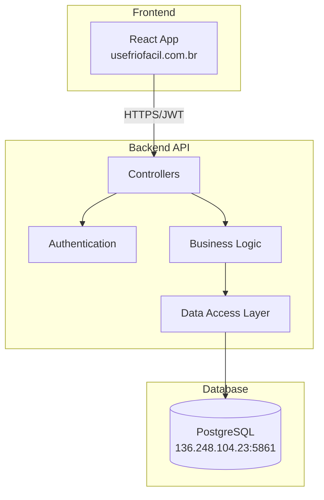

# Backend API - Visão Geral

A API Backend do FrioFácil é construída em **ASP.NET Core 8** e serve como o núcleo do sistema, gerenciando autenticação, dados de usuários, empresas e toda a lógica de negócio principal.

## 🚀 Características Principais

- **Framework**: ASP.NET Core 8
- **Linguagem**: C#
- **Banco de Dados**: PostgreSQL
- **Autenticação**: JWT Bearer Tokens
- **CORS**: Configurado para produção
- **Health Checks**: Endpoint de monitoramento
- **Dockerizado**: Pronto para produção

## 🏗️ Arquitetura



## 🌐 Informações de Deployment

| Configuração | Valor |
|--------------|-------|
| **Domínio** | `backend.usefriofacil.com.br` |
| **Porta Interna** | 65012 |
| **Protocolo** | HTTPS (Produção) |
| **Health Check** | `/api/friofacil/health` |
| **Ambiente** | Production |

## 📋 Principais Endpoints

### 🔐 Autenticação
- `POST /api/friofacil/login` - Login de usuário
- `POST /api/friofacil/register` - Registro de usuário

### 👤 Usuários
- `GET /api/friofacil/myaccount` - Dados do usuário logado
- `DELETE /api/friofacil/userdelete` - Exclusão de conta

### 🏢 Empresas
- `POST /api/friofacil/createtempcompany` - Criar empresa temporária
- `DELETE /api/friofacil/companydelete/{id}` - Excluir empresa

### 🏠 Dashboard
- `GET /api/friofacil/home` - Dados do dashboard

### 📨 Convites
- `PATCH /api/friofacil/respondinvite` - Responder convite

### 🩺 Monitoramento
- `GET /api/friofacil/health` - Health check

## 🔧 Configuração

### appsettings.json
```json
{
  "AllowedHosts": "backend.usefriofacil.com.br;usefriofacil.com.br;*.usefriofacil.com.br;localhost;*",
  "ConnectionStrings": {
    "DefaultConnection": "Host=136.248.104.23;Port=5861;Database=FrioFacil;Username=FrioFacilUserData;Password=..."
  }
}
```

### CORS Policy
```csharp
services.AddCors(opcoes =>
{
    opcoes.AddPolicy("Permission", policy =>
    {
        policy.WithOrigins(
                "https://usefriofacil.com.br",
                "http://usefriofacil.com.br",
                "https://frontend.usefriofacil.com.br",
                "http://frontend.usefriofacil.com.br"
              )
              .AllowAnyMethod()
              .AllowAnyHeader()
              .AllowCredentials();
    });
});
```

### Forwarded Headers
```csharp
builder.Services.Configure<ForwardedHeadersOptions>(options =>
{
    options.ForwardedHeaders = ForwardedHeaders.XForwardedFor | ForwardedHeaders.XForwardedProto;
    options.KnownNetworks.Clear();
    options.KnownProxies.Clear();
});
```

## 🐳 Docker Configuration

### Dockerfile
```dockerfile
# Production Dockerfile for FrioFacil Backend API
FROM mcr.microsoft.com/dotnet/aspnet:8.0 AS base
WORKDIR /app

# Install curl for health checks
RUN apt-get update && apt-get install -y curl

# Create non-root user
RUN adduser --disabled-password --home /app --gecos '' dotnetuser && chown -R dotnetuser /app
USER dotnetuser

FROM mcr.microsoft.com/dotnet/sdk:8.0 AS build
WORKDIR /src
COPY ["FrioFacilBackend.Api/FrioFacilBackend.Api.csproj", "FrioFacilBackend.Api/"]
RUN dotnet restore "FrioFacilBackend.Api/FrioFacilBackend.Api.csproj"
COPY . .
WORKDIR "/src/FrioFacilBackend.Api"
RUN dotnet build "FrioFacilBackend.Api.csproj" -c Release -o /app/build

FROM build AS publish
RUN dotnet publish "FrioFacilBackend.Api.csproj" -c Release -o /app/publish

FROM base AS final
WORKDIR /app
COPY --from=publish /app/publish .

# Configure ASP.NET Core for production
ENV ASPNETCORE_ENVIRONMENT=Production
ENV ASPNETCORE_URLS=http://+:65012
ENV ASPNETCORE_HTTP_PORTS=65012

EXPOSE 65012

ENTRYPOINT ["dotnet", "FrioFacilBackend.Api.dll"]
```

### docker-compose (Dokploy)
```yaml
backend:
  build: 
    context: ./FrioFacil-Backend
    dockerfile: Dockerfile
  ports:
    - "65012:65012"
  environment:
    - ASPNETCORE_ENVIRONMENT=Production
    - ASPNETCORE_URLS=http://+:65012
    - ASPNETCORE_FORWARDEDHEADERS_ENABLED=true
  healthcheck:
    test: ["CMD", "curl", "-f", "http://localhost:65012/api/friofacil/health"]
    interval: 30s
    timeout: 10s
    retries: 3
    start_period: 40s
  networks:
    - friofacil-network
  restart: unless-stopped
```

## 🔍 Health Check Response

```json
{
  "status": "healthy",
  "timestamp": "2025-01-08T10:30:00.000Z",
  "service": "FrioFacil Backend API"
}
```

## 📊 Estrutura do Projeto

```
FrioFacil-Backend/
├── FrioFacilBackend.Api/
│   ├── Controllers/
│   │   └── HomeController.cs      # Endpoints principais
│   ├── Models/                    # Modelos de dados
│   ├── Services/                  # Lógica de negócio
│   ├── Data/                      # Contexto do banco
│   ├── Program.cs                 # Configuração da aplicação
│   ├── appsettings.json           # Configurações
│   └── FrioFacilBackend.Api.csproj
├── Dockerfile                     # Container de produção
└── README.md
```

## 🔗 Recursos Relacionados

- [🏗️ Visão Geral da Arquitetura](../overview.md)
- [🎨 Frontend](../frontend/overview.md)
- [💳 Payment API](../payment-api/overview.md)
- [🔧 Backend GitHub Repository](https://github.com/UseFrioFacil/FrioFacil-Backend)