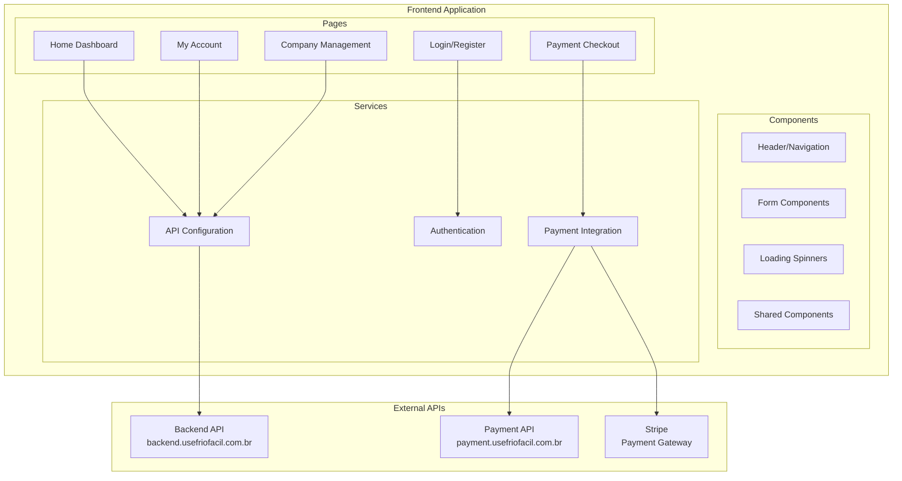

# Frontend - Visão Geral

O Frontend do FrioFácil é uma aplicação moderna construída em **React 18** com **TypeScript** e **Vite**, oferecendo uma interface responsiva e intuitiva para gestão de manutenção preventiva de sistemas de refrigeração.

## 🚀 Características Principais

- **Framework**: React 18 + TypeScript
- **Build Tool**: Vite 7.0
- **Styling**: CSS Modules + CSS personalizado
- **Integração**: Axios para APIs
- **Pagamentos**: Stripe React Components
- **Roteamento**: React Router DOM
- **Notificações**: React Toastify
- **Ícones**: Lucide React

## 🏗️ Arquitetura



## 🌐 Informações de Deployment

| Configuração | Valor |
|--------------|-------|
| **Domínio** | `usefriofacil.com.br` |
| **Porta Interna** | 24319 |
| **Protocolo** | HTTPS (Produção) |
| **Build Tool** | Vite |
| **Environment** | Production |

## 📱 Páginas Principais

### 🔐 Autenticação
- **Login** (`/login`) - Autenticação de usuários
- **Register** (`/register`) - Cadastro de novos usuários

### 🏠 Dashboard
- **Home** (`/home`) - Dashboard principal com empresas e convites
- **My Account** (`/minhaconta`) - Perfil do usuário e assinaturas

### 🏢 Gestão Empresarial
- **Register Company** (`/registercompany`) - Cadastro de empresas
- **Company Management** - Gestão de empresas vinculadas

### 💳 Pagamentos
- **Checkout** (`/checkout`) - Processo de pagamento e assinaturas
- **Payment Plans** - Seleção de planos

### 🛠️ Serviços
- **Request Service** (`/requestservice`) - Solicitação de serviços

## ⚙️ Configuração de APIs

### API Configuration
```typescript
// src/config/api.ts
const API_CONFIG = {
  // Backend API
  BASE_URL: 'https://backend.usefriofacil.com.br',
  
  // Payment API
  PAYMENT_BASE_URL: 'https://payment.usefriofacil.com.br',
  
  ENDPOINTS: {
    // Auth
    LOGIN: '/api/friofacil/login',
    REGISTER: '/api/friofacil/register',
    MY_ACCOUNT: '/api/friofacil/myaccount',
    
    // Companies
    CREATE_TEMP_COMPANY: '/api/friofacil/createtempcompany',
    COMPANY_DELETE: '/api/friofacil/companydelete',
    
    // Dashboard
    HOME: '/api/friofacil/home',
    RESPOND_INVITE: '/api/friofacil/respondinvite',
  },
  
  PAYMENT_ENDPOINTS: {
    CREATE_SUBSCRIPTION: '/api/create-subscription',
    CANCEL_SUBSCRIPTION: '/api/cancel-subscription',
    GET_SUBSCRIPTIONS: '/api/subscriptions/me',
  }
};
```

### URL Helpers
```typescript
// Helper functions
export const getApiUrl = (endpoint: string): string => {
  return `${API_CONFIG.BASE_URL}${endpoint}`;
};

export const getPaymentApiUrl = (endpoint: string): string => {
  return `${API_CONFIG.PAYMENT_BASE_URL}${endpoint}`;
};

// Ready-to-use URLs
export const API_URLS = {
  LOGIN: getApiUrl(API_CONFIG.ENDPOINTS.LOGIN),
  REGISTER: getApiUrl(API_CONFIG.ENDPOINTS.REGISTER),
  MY_ACCOUNT: getApiUrl(API_CONFIG.ENDPOINTS.MY_ACCOUNT),
  // ... outros endpoints
};
```

## 🔐 Autenticação

### JWT Token Management
```typescript
// Login process
const handleLogin = async (credentials) => {
  const response = await axios.post(API_URLS.LOGIN, credentials);
  localStorage.setItem("accessToken", response.data.token);
  navigate('/home');
};

// Protected requests
const token = localStorage.getItem("accessToken");
const config = { 
  headers: { Authorization: `Bearer ${token}` } 
};
const response = await axios.get(API_URLS.MY_ACCOUNT, config);
```

## 🎨 Componentes Reutilizáveis

### FormInput Component
```typescript
interface FormInputProps {
  id: string;
  label: string;
  type: string;
  value: string;
  onChange: (e: React.ChangeEvent<HTMLInputElement>) => void;
  icon?: React.ReactNode;
  required?: boolean;
}
```

### LoadingSpinner Component
```typescript
interface LoadingSpinnerProps {
  size?: 'small' | 'medium' | 'large';
  text?: string;
}
```

### Header Component
```typescript
interface HeaderProps {
  userFullName?: string;
  onLogout: () => void;
}
```

## 🐳 Docker Configuration

### Dockerfile
```dockerfile
# Production Dockerfile for FrioFacil Frontend
FROM node:18-alpine AS build

WORKDIR /app

# Copy package files
COPY package*.json ./

# Install dependencies
RUN npm ci --silent

# Copy source code
COPY . .

# Clean previous builds and build for production
RUN rm -rf dist node_modules/.cache
RUN npm run build

# Production stage with nginx
FROM nginx:alpine

# Install curl for health checks
RUN apk add --no-cache curl

# Copy build files
COPY --from=build /app/dist /usr/share/nginx/html

# Copy nginx configuration
COPY nginx.conf /etc/nginx/nginx.conf

# Set permissions
RUN chown -R nginx:nginx /usr/share/nginx/html

EXPOSE 24319

HEALTHCHECK --interval=30s --timeout=10s --start-period=30s --retries=3 \
    CMD curl -f http://localhost:24319 || exit 1

CMD ["nginx", "-g", "daemon off;"]
```

### docker-compose (Dokploy)
```yaml
frontend:
  build: 
    context: ./FrioFacil-Frontend
    dockerfile: Dockerfile
  ports:
    - "24319:24319"
  environment:
    - NODE_ENV=production
  healthcheck:
    test: ["CMD", "curl", "-f", "http://localhost:24319"]
    interval: 30s
    timeout: 10s
    retries: 3
    start_period: 30s
  networks:
    - friofacil-network
  restart: unless-stopped
```

## 📦 Estrutura do Projeto

```
FrioFacil-Frontend/
├── public/
│   ├── index.html
│   └── assets/
├── src/
│   ├── components/           # Componentes reutilizáveis
│   │   ├── Header/
│   │   ├── Form/
│   │   └── Loading/
│   ├── pages/               # Páginas da aplicação
│   │   ├── Login/
│   │   ├── Register/
│   │   ├── Home/
│   │   ├── MyAccount/
│   │   ├── Checkout/
│   │   └── RegisterCompany/
│   ├── config/              # Configurações
│   │   └── api.ts           # URLs e configuração das APIs
│   ├── routes/              # Configuração de rotas
│   │   └── AppRoutes.tsx
│   ├── styles/              # Estilos globais
│   └── main.tsx             # Entry point
├── package.json
├── vite.config.ts
├── tsconfig.json
├── Dockerfile
└── .dockerignore
```

## 🚀 Scripts Disponíveis

```json
{
  "scripts": {
    "dev": "vite",
    "build": "tsc -b && vite build",
    "preview": "vite preview",
    "lint": "eslint . --ext ts,tsx --report-unused-disable-directives --max-warnings 0"
  }
}
```

## 🔗 Recursos Relacionados

- [🏗️ Visão Geral da Arquitetura](../overview.md)
- [🔧 Backend API](../backend/overview.md)
- [💳 Payment API](../payment-api/overview.md)
- [🎨 Frontend GitHub Repository](https://github.com/UseFrioFacil/FrioFacil-Frontend)