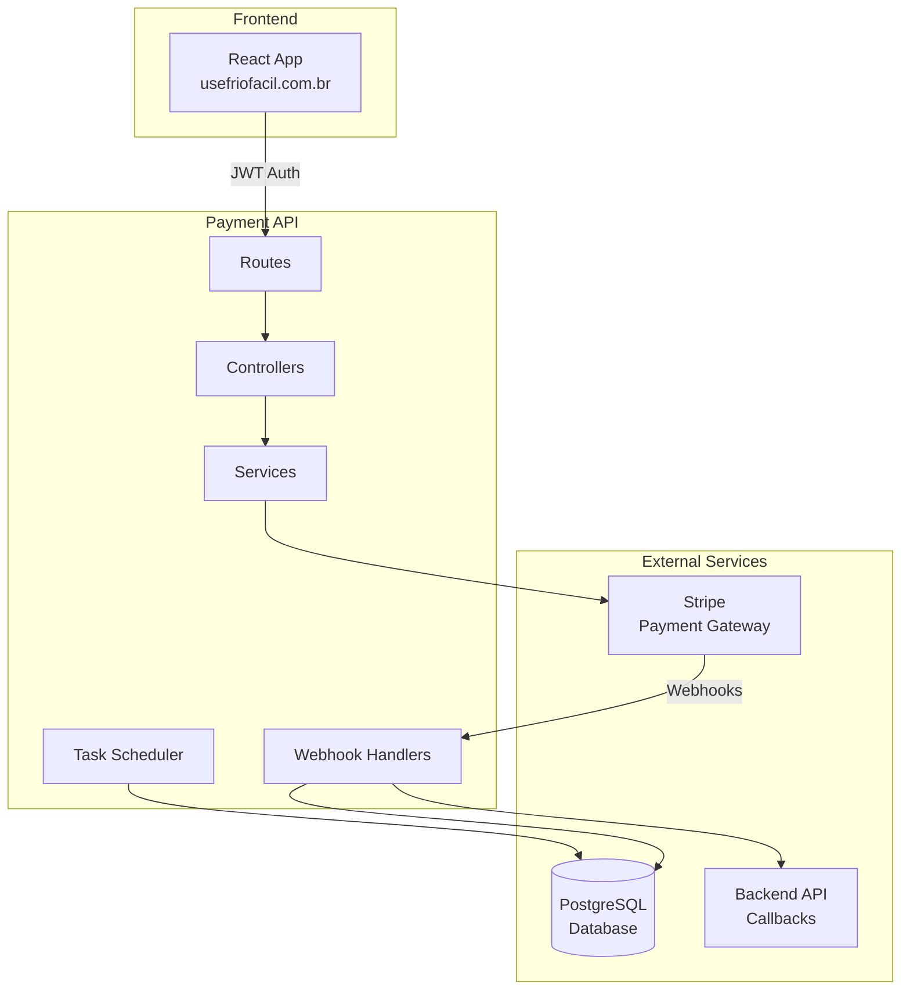
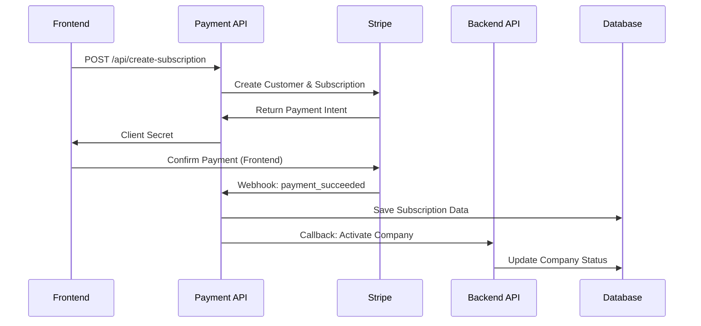

# Payment API - Visão Geral

A Payment API do FrioFácil é construída em **Node.js** com **Express** e **Stripe**, responsável por gerenciar todo o processamento de pagamentos, assinaturas e integração com gateways de pagamento.

## 🚀 Características Principais

- **Framework**: Node.js + Express
- **Gateway de Pagamento**: Stripe
- **Autenticação**: JWT (compartilhado com Backend)
- **Database**: PostgreSQL (compartilhado)
- **Webhooks**: Processamento automático
- **Agendamento**: BullMQ + Redis para tarefas
- **Dockerizado**: Pronto para produção

## 🏗️ Arquitetura



## 🌐 Informações de Deployment

| Configuração | Valor |
|--------------|-------|
| **Domínio** | `payment.usefriofacil.com.br` |
| **Porta Interna** | 15596 |
| **Protocolo** | HTTPS (Produção) |
| **Health Check** | `/health` |
| **Environment** | Production |

## 📋 Principais Endpoints

### 💳 Assinaturas
- `POST /api/create-subscription` - Criar nova assinatura
- `GET /api/subscriptions/me` - Listar assinaturas do usuário
- `POST /api/cancel-subscription/:id` - Cancelar assinatura

### 🍎 Payment Methods
- `GET /api/apple-pay-status` - Status do Apple Pay
- `GET /api/google-pay-status` - Status do Google Pay

### ⚙️ Setup
- `POST /api/setup-products` - Configurar produtos no Stripe

### 🔔 Webhooks
- `POST /webhook/stripe` - Webhook do Stripe

### 🩺 Monitoramento
- `GET /health` - Health check

## 🔧 Configuração

### config.env
```env
# Servidor
PORT=15596
NODE_ENV=production

# Stripe
STRIPE_SECRET_KEY=sk_live_...
STRIPE_WEBHOOK_SECRET=whsec_...

# JWT (compartilhado com Backend)
JWT_SECRET=307b22718ab12aa8d0f55ad092b9ea7f

# APIs Integradas
C_SHARP_API_URL=https://backend.usefriofacil.com.br
FRONTEND_URL=https://usefriofacil.com.br

# Database PostgreSQL
DB_HOST=136.248.104.23
DB_PORT=5861
DB_DATABASE=FrioFacil
DB_USER=FrioFacilUserData
DB_PASSWORD=...
```

### CORS Configuration
```javascript
const CORS_ORIGINS = [
  'http://localhost:24319',           // desenvolvimento
  'http://localhost:3000',            // desenvolvimento  
  'http://localhost:8181',            // desenvolvimento
  'https://usefriofacil.com.br',      // produção
  'https://frontend.usefriofacil.com.br' // produção
];

app.use(cors({ origin: CORS_ORIGINS, credentials: true }));
```

## 💰 Integração com Stripe

### Produtos e Preços
```javascript
// Configuração dos planos
const PLANS = {
  BASIC: {
    name: 'Plano Básico',
    priceId: 'price_basic_monthly',
    price: 2999, // R$ 29,99
    features: ['Até 5 empresas', 'Relatórios básicos']
  },
  PROFESSIONAL: {
    name: 'Plano Profissional', 
    priceId: 'price_pro_monthly',
    price: 4999, // R$ 49,99
    features: ['Empresas ilimitadas', 'Relatórios avançados']
  }
};
```

### Criação de Assinatura
```javascript
const subscription = await stripe.subscriptions.create({
  customer: customerId,
  items: [{ price: priceId }],
  payment_behavior: 'default_incomplete',
  payment_settings: { save_default_payment_method: 'on_subscription' },
  expand: ['latest_invoice.payment_intent'],
  metadata: {
    companytempid: companyTempId,
    plan_type: planType
  }
});
```

## 🔄 Fluxo de Pagamento



## 🔔 Webhook Processing

### Eventos Suportados
```javascript
const WEBHOOK_EVENTS = {
  SUBSCRIPTION_CREATED: 'customer.subscription.created',
  SUBSCRIPTION_UPDATED: 'customer.subscription.updated', 
  PAYMENT_SUCCEEDED: 'invoice.payment_succeeded',
  PAYMENT_FAILED: 'invoice.payment_failed'
};
```

### Processamento de Webhook
```javascript
app.post('/webhook/stripe', express.raw({type: 'application/json'}), (req, res) => {
  const sig = req.headers['stripe-signature'];
  
  try {
    const event = stripe.webhooks.constructEvent(req.body, sig, WEBHOOK_SECRET);
    
    switch (event.type) {
      case 'invoice.payment_succeeded':
        await handlePaymentSuccess(event.data.object);
        break;
      case 'customer.subscription.updated':
        await handleSubscriptionUpdate(event.data.object);
        break;
    }
    
    res.json({received: true});
  } catch (err) {
    res.status(400).send(`Webhook Error: ${err.message}`);
  }
});
```

## 🐳 Docker Configuration

### Dockerfile
```dockerfile
# Production Dockerfile for FrioFacil Payment API
FROM node:18-alpine AS base

# Install security updates and required packages
RUN apk update && apk upgrade && apk add --no-cache \
    curl \
    dumb-init \
    && rm -rf /var/cache/apk/*

# Create non-root user
RUN addgroup -g 1001 -S nodejs && \
    adduser -S friofacil -u 1001

# Set working directory
WORKDIR /app

# Copy package files
COPY package*.json ./

# Install dependencies with cache optimization
RUN npm ci --only=production --silent && \
    npm cache clean --force

# Copy application code
COPY --chown=friofacil:nodejs . .

# Switch to non-root user
USER friofacil

# Configure production environment
ENV NODE_ENV=production
ENV PORT=15596

# Expose port
EXPOSE 15596

# Health check
HEALTHCHECK --interval=30s --timeout=10s --start-period=30s --retries=3 \
    CMD curl -f http://localhost:15596/health || exit 1

# Use dumb-init to handle signals properly
ENTRYPOINT ["dumb-init", "--"]
CMD ["npm", "start"]
```

### docker-compose (Dokploy)
```yaml
payment-api:
  build:
    context: ./FrioFacil-payment-api
    dockerfile: Dockerfile
  ports:
    - "15596:15596"
  environment:
    - NODE_ENV=production
    - PORT=15596
  healthcheck:
    test: ["CMD", "curl", "-f", "http://localhost:15596/health"]
    interval: 30s
    timeout: 10s
    retries: 3
    start_period: 30s
  networks:
    - friofacil-network
  restart: unless-stopped
```

## 🔍 Health Check Response

```json
{
  "status": "healthy",
  "timestamp": "2025-01-08T10:30:00.000Z",
  "service": "FrioFacil Payment API",
  "version": "1.0.0",
  "stripe": "connected",
  "database": "connected"
}
```

## 📊 Estrutura do Projeto

```
FrioFacil-payment-api/
├── src/
│   ├── controllers/              # Controladores da API
│   │   ├── subscriptionController.js
│   │   ├── customerController.js
│   │   ├── paymentController.js
│   │   └── webhookController.js
│   ├── services/                 # Lógica de negócio
│   │   ├── stripeService.js
│   │   ├── notificationService.js
│   │   └── customerService.js
│   ├── routes/                   # Definição de rotas
│   │   ├── subscriptionRoutes.js
│   │   ├── customerRoutes.js
│   │   ├── paymentRoutes.js
│   │   └── webhookRoutes.js
│   ├── middleware/               # Middlewares
│   │   ├── logging.js
│   │   ├── validation.js
│   │   └── auth.js               # Validação JWT
│   ├── utils/                    # Utilitários
│   │   ├── constants.js
│   │   └── helpers.js
│   ├── schedulers/               # Agendamento de tarefas
│   │   └── retry-pending-callbacks.js
│   ├── config/                   # Configurações
│   │   └── stripe.js
│   └── app.js                    # Aplicação principal
├── server.js                     # Entry point
├── package.json
├── config.env                    # Variáveis de ambiente
├── Dockerfile
└── README.md
```

## 🔗 Recursos Relacionados

- [🏗️ Visão Geral da Arquitetura](../overview.md)
- [🔧 Backend API](../backend/overview.md)
- [🎨 Frontend](../frontend/overview.md)
- [💳 Payment API GitHub Repository](https://github.com/UseFrioFacil/FrioFacil-payment-api)